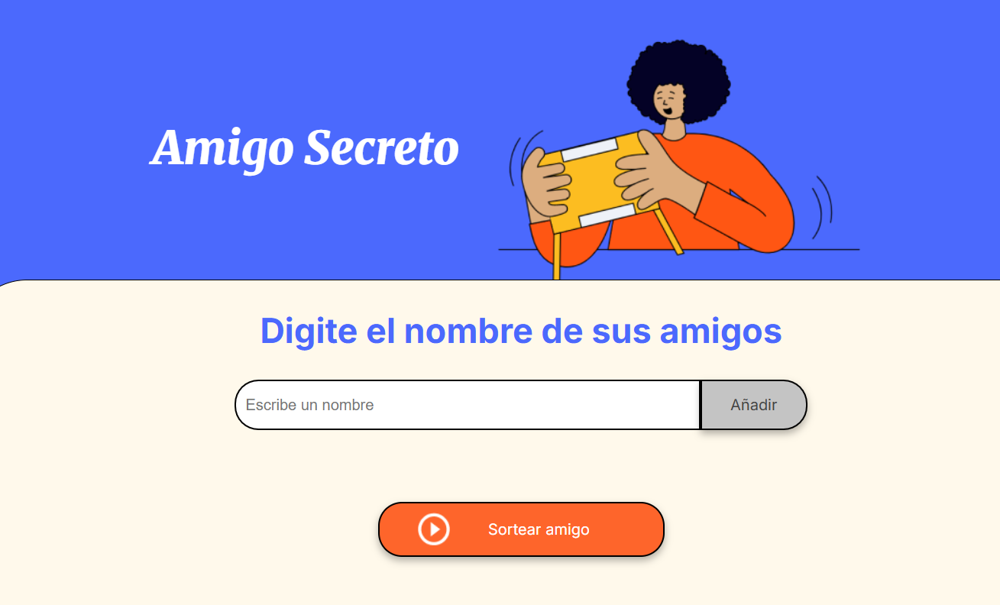

# Challenge Amigo Secreto

Una aplicación web interactiva para organizar sorteos de amigo secreto de manera fácil y divertida.



## 📋 Descripción

**Amigo Secreto** es una aplicación desarrollada como parte del Challenge de Principiante en Programación de Alura. Este proyecto implementa la lógica necesaria para crear listas de participantes y realizar sorteos aleatorios, poniendo en práctica conceptos fundamentales de JavaScript.

## 🚀 Funcionalidades

- ✅ **Agregar participantes**: Añade nombres a la lista de forma dinámica
- ✅ **Validación de entrada**: Previene nombres vacíos o duplicados
- ✅ **Sorteo aleatorio**: Selecciona un amigo secreto de manera aleatoria
- ✅ **Interfaz intuitiva**: Diseño limpio y fácil de usar
- ✅ **Responsive**: Adaptable a diferentes tamaños de pantalla

## 🛠️ Tecnologías Utilizadas

- **HTML5**: Estructura semántica de la página
- **CSS3**: Estilos modernos con variables CSS y Flexbox
- **JavaScript**: Lógica de programación y manipulación del DOM
- **Google Fonts**: Tipografías Inter y Merriweather

## 📁 Estructura del Proyecto

```
amigo-secreto/
├── index.html         # Página principal
├── style.css          # Estilos de la aplicación
├── app.js             # Lógica de JavaScript
├── assets/            # Recursos multimedia
│   ├── amigo-secreto.png
│   └── play_circle_outline.png
└── README.md          # Documentación del proyecto
```

## 🎯 Cómo Usar

1. **Agregar participantes**:
   - Escribe un nombre en el campo de texto
   - Haz clic en "Añadir" 
   - El nombre aparecerá en la lista de participantes

2. **Realizar sorteo**:
   - Asegúrate de tener al menos 2 participantes
   - Haz clic en "Sortear amigo"
   - El resultado aparecerá destacado en pantalla

## 🔧 Instalación y Ejecución

1. Clona este repositorio:
```bash
git clone https://github.com/EM1518/challenge-amigo-secreto-elisanna-martinez.git
```

2. Abre `index.html` en tu navegador 

## 📚 Conceptos Aplicados

Este proyecto demuestra el dominio de:

- **Manipulación del DOM**: Creación y modificación de elementos HTML
- **Arrays en JavaScript**: Almacenamiento y gestión de datos
- **Funciones**: Modularización del código
- **Eventos**: Interacción con el usuario
- **Validaciones**: Control de entrada de datos
- **Algoritmos**: Generación de números aleatorios
- **Buenas prácticas**: Código limpio y semántico

## 🏆 Challenge Alura - ONE

Este proyecto forma parte del programa **Oracle Next Education (ONE)** en asociación con **Alura LATAM**, utilizando la metodología *Challenge-Based Learning* desarrollada por Apple. 

### Objetivos del Challenge:
- ✅ Consolidar conocimientos de lógica de programación
- ✅ Dominar el pensamiento lógico y algorítmico
- ✅ Mejorar habilidades de análisis y resolución de problemas
- ✅ Ampliar perspectivas en el desarrollo web

## 📝 Licencia

Este proyecto está bajo la Licencia MIT.

## 👨‍💻 Autora

Elisanna Martínez 

---

*Proyecto desarrollado durante la formación en Alura - Oracle Next Education*
